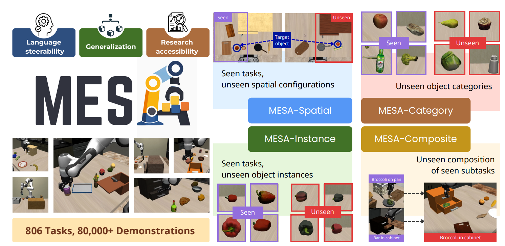

# MESA: An Evaluation Framework for Compositional, Semantic, and Spatial Generalization in Robotics

### 🌐 [Project Website](https://www.pair.toronto.edu/MESA/) | 📚 [Documentation](https://www.pair.toronto.edu/MESA/documentation/index.html) | 🤗 [Weights and Data](https://huggingface.co/collections/albertwilcox/mesa) | 📄 [Paper](https://www.pair.toronto.edu/MESA/)



MESA is a framework for building, scaling, and evaluating language-conditioned tabletop manipulation policies.
The project includes:

- **MESA-Gen** for scalable task and demonstration generation.
- **MESA-Bench** for standardized evaluation across in-distribution, spatial, category, instance, and compositional generalization settings.

## Installation

MESA uses `uv` for environment and dependency management.

1. Install `uv` using the official guide: https://docs.astral.sh/uv/getting-started/installation/
2. Sync dependencies from the repository root:
   ```bash
   uv sync
   ```
3. Optional: install LeRobot export dependencies:
   ```bash
   uv sync --extra lerobot
   ```
4. Run setup scripts:
   ```bash
   ./scripts/setup.sh
   ```

For detailed setup instructions, see `docs/getting_started/installation.md`.

## Acknowledgements

MESA builds on top of and draws inspiration from the following projects:

- [MimicLabs](https://robo-mimiclabs.github.io/)
- [MimicGen](https://github.com/NVlabs/mimicgen)
- [OpenPI](https://github.com/Physical-Intelligence/openpi)
- [LeRobot](https://github.com/huggingface/lerobot)
- [RoboCasa](https://github.com/robocasa/robocasa)
- [LIBERO](https://github.com/Lifelong-Robot-Learning/LIBERO)
- [tyro](https://github.com/brentyi/tyro)

See `docs/other/acknowledgement.md` for the documentation version of this list.

## Citation

If you find MESA useful in your research, please cite:

```bibtex
@article{mesa2026,
  author    = {Albert Wilcox and Frank Chang and Aishani Chakraborty and Nhi Nguyen and Jeremy A. Collins and Vaibhav Saxena and Benjamin Joffe and Siddhath Karamcheti and Animesh Garg},
  title     = {MESA: An Evaluation Framework for Compositional, Semantic, and Spatial Generalization in Robotics},
  journal   = {arXiv preprint},
  year      = {2026},
}
```

## License

This repository is released under the **MIT License**. See `LICENSE` for full terms.