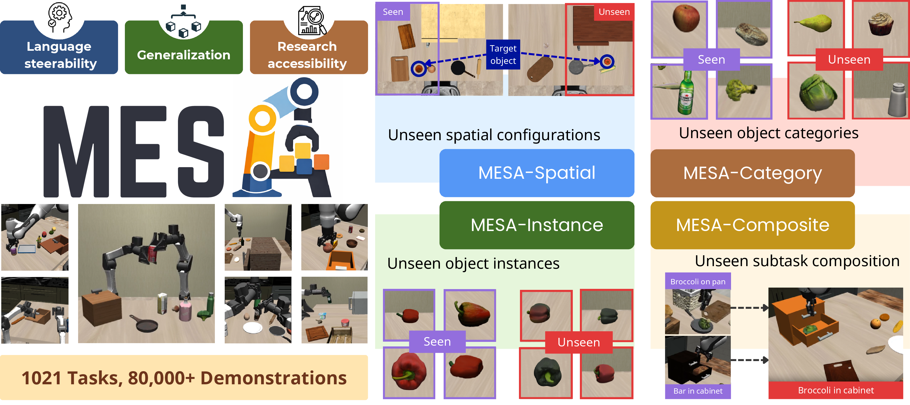

# MESA: An Evaluation Framework for Compositional, Semantic, and Spatial Generalization in Robotics

### 🌐 [Project Website](https://pairlab.github.io/MESA/) | 📚 [Documentation](https://pairlab.github.io/MESA/documentation/index.html) | 🤗 [Weights and Data](https://huggingface.co/collections/albertwilcox/mesa) | 📄 [Paper](https://pairlab.github.io/MESA/)



MESA is a framework for building, scaling, and evaluating language-conditioned tabletop manipulation policies.
The project includes:

- **MESA-Gen** for scalable task and demonstration generation.
- **MESA-Bench** for standardized evaluation across in-distribution, spatial, category, instance, and compositional generalization settings.

## Installation

MESA uses `uv` for environment and dependency management.

1. Install `uv` using the official guide: https://docs.astral.sh/uv/getting-started/installation/
2. Clone the public repository:
   ```bash
   git clone https://github.com/pairlab/mesa-env.git mesa
   cd mesa
   ```
3. Sync dependencies from the repository root:
   ```bash
   uv sync
   ```
4. Optional: install LeRobot export dependencies:
   ```bash
   uv sync --extra lerobot
   ```
5. Run setup scripts (configures robosuite and downloads the simulation assets and the fixed evaluation initial states from Hugging Face):
   ```bash
   ./scripts/setup.sh
   ```

For detailed setup instructions, see `docs/getting_started/installation.md`.

## Acknowledgements

MESA builds on top of and draws inspiration from the following projects:

- [MimicLabs](https://robo-mimiclabs.github.io/)
- [MimicGen](https://github.com/NVlabs/mimicgen)
- [OpenPI](https://github.com/Physical-Intelligence/openpi)
- [LeRobot](https://github.com/huggingface/lerobot)
- [RoboCasa](https://github.com/robocasa/robocasa)
- [LIBERO](https://github.com/Lifelong-Robot-Learning/LIBERO)
- [tyro](https://github.com/brentyi/tyro)

See `docs/other/acknowledgement.md` for the documentation version of this list.

## Citation

If you find MESA useful in your research, please cite:

```bibtex
@inproceedings{
wilcox2026mesa,
title={{MESA}: An Evaluation Framework for Compositional, Semantic, and Spatial Generalization in Robotics},
author={Wilcox, Albert and Chang, Frank and Nguyen, Nhi and Chakraborty, Aishani and Collins, Jeremy A. and Saxena, Vaibhav and Joffe, Benjamin and Karamcheti, Siddharth and Garg, Animesh},
booktitle={10th Annual Conference on Robot Learning},
year={2026},
url={https://openreview.net/forum?id=Br2rXixvyN}
}
```

## License

This repository is released under the **MIT License**. See `LICENSE` for full terms.